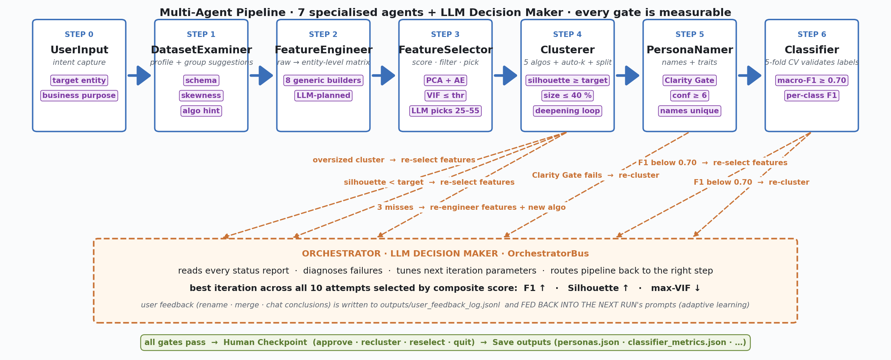
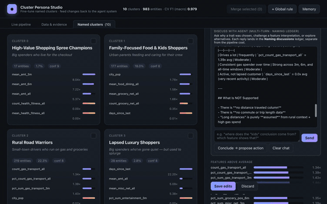
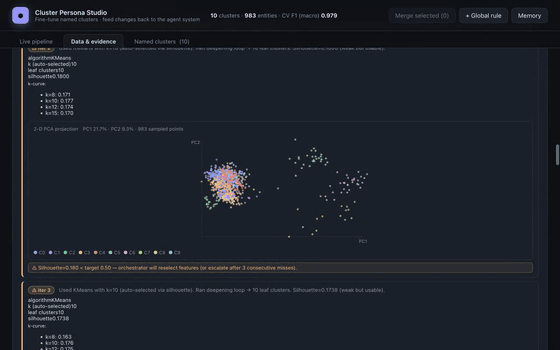

# Agentic Clustering & Auto-Labeling: Autonomous Cluster Interpretation with a Multi-Agent System

[](LICENSE)
[](https://www.python.org/)

> **The hard part of unsupervised clustering is not the mathematics — it's extracting the meaning.**

**Agentic Clustering & Auto-Labeling** is an autonomous machine learning pipeline that uses an LLM-driven multi-agent architecture to automatically cluster datasets, engineer features, interpret the results, and generate human-readable cluster personas. It bridges the gap between raw statistical grouping and actionable data insights.

**Authorship note:** Agentic Labelling was originally proposed and implemented by **Tzu-Chun Chen**. The repository was initialized on **2026-02-25**, and the first explicit git commit for the agentic auto-clustering and labelling idea was authored by Tzu-Chun Chen on **2026-02-26**. If you build on this repository, cite the project and retain the repository's authorship and license notices.

---

## 📑 Table of Contents

- [TL;DR](#-tldr)
- [Architecture & Agent Roles](#️-architecture--agent-roles)
- [Quick Start](#-quick-start)
- [Interactive UI + Adaptive Learning](#-interactive-ui--adaptive-learning-human-in-the-loop-ai)
- [Text Modality](#-text-modality-document--article-clustering)
- [Configuration](#️-configuration-configyaml)
- [Outputs & Generated Artifacts](#-outputs--generated-artifacts)
- [Authorship & Citation](#-authorship--citation)
- [Provenance](#-provenance)
- [Skills](#️-skills)
- [Appendix: Agentic Workflow vs AutoML](#-appendix-agentic-workflow-vs-automl)
- [Tech Stack & Keywords](#-tech-stack--indexing-keywords)
- [License](#-license)
- [Contributing](#-contributing)
- [Security & Support](#-security--support)

---

## ⚡ TL;DR

**Agentic Labelling** tackles a very practical pain point in business clustering:

> *The hard part of clustering was never the math; it's extracting meaning.*

In real business domains, we often do not have labeled data or clear ground truth. Data scientists go through the exhausting loop of feature engineering → selection → re-clustering → validation → *"what does this mean?"* → repeat, just to find patterns that are actually meaningful.

This project explores how to hand that loop to AI agents through reasoned feedback loops, with two ideas at the core:

When we say *loop*, we don't mean letting agents wander **non-deterministically** until something sticks. The pipeline is a **pre-defined loop**: every valid path and quality gate is wired up front in static `if`/`else` logic (see [`run_pipeline.py`](run_pipeline.py) and the Orchestrator). Deterministic code evaluates **feedback** (silhouette, Clarity, classifier F1, VIF) against the run's **goal**; the LLM's job is narrower—given that feedback, **choose which pre-defined branch to loop back to** (e.g. re-select features vs. re-cluster). Software engineering owns the structure and gates; the LLM supplies routing judgment. That split is a key reason token cost stays so low.

- **⚙️ Loop + Guardrails = Autonomy:** Agents operate inside that fixed, feedback-driven loop—static code enforces every gate; the LLM picks among pre-defined retry paths, never marking its own homework.
- **👥 Human-in-the-Loop = Adaptive Learning:** Agents show their analysis transparently, dynamically adapting to your guidance rather than starting from zero.
- **💰 Incredibly Cost-Effective:** 10 full runs of discovery-to-naming costs less than **$1 USD for 1 million rows**. LLMs are invoked for targeted reasoning and naming the final handful of clusters—not for blindly processing millions of rows—so the pipeline stays highly efficient and cheap.

---

## 🏗️ Architecture & Agent Roles



Solid arrows = forward path; dotted arrows = feedback loops. The Orchestrator + LLM Decision Maker reads every status report, diagnoses failures, tunes the next iteration's parameters, and routes the pipeline back to whichever step needs to re-run. The best iteration across all 10 attempts is picked by a composite score balancing accuracy, separation, and non-redundancy as F1 ↑ · Silhouette ↑ · max-VIF ↓.: 

$$\text{Composite Score} = F_1 \cdot \text{Silhouette} \cdot \frac{1}{\text{max-VIF}}$$

### Core Multi-Agent Breakdown

To optimize performance and handle bottlenecks, tasks are delegated to specialized agents:

* **Dataset Examiner:** Profiles distributions, identifies data types, and flags initial anomalies.
* **Feature Engineer:** Proposes and applies domain-specific mathematical transformations autonomously.
* **Feature Selector:** Detects multi-collinearity and optimizes feature importance, keeping Variance Inflation Factor (VIF) < 5.0.
* **Clusterer:** Sweeps multiple algorithms (K-Means, DBSCAN, GMM) and optimizes hyperparameter $k$.
* **Persona Namer:** Translates cluster centroids and distinct feature patterns into human-readable archetypes.
* **Classifier:** Trains an internal proxy model (e.g., XGBoost, Random Forest) to verify if the clusters are distinct and mathematically reproducible ($F_1$ score gate).

---

## 🚀 Quick Start

### Prerequisites

- **Python 3.10+**
- An **Anthropic API key** — the agents and LLM Decision Maker call Anthropic Claude
  (default model: `claude-sonnet-4-6`) via the official `anthropic` Python SDK.
  Get a key at <https://console.anthropic.com/>.
- *(Optional)* The text-clustering modality uses `sentence-transformers` embeddings
  when installed; otherwise it falls back to TF-IDF + TruncatedSVD and runs fully offline.

### Installation

```bash
# Clone the repository
git clone https://github.com/ginaecho/agentic-labeling.git
cd agentic-labeling

# Install dependencies
pip install -r requirements.txt

# Configure your environment variables
export LLM_API_KEY="sk-ant-..."        # or add to .env
```

Run the Pipeline
Executing the script automatically triggers the pipeline and provisions the web interface in your default browser:

```bash
python run_pipeline.py
```

CLI Flags:
```bash
--no-ui: Runs the agentic pipeline in headless mode directly inside the terminal.

--ui-port 5090: Modifies the default web UI hosting port.

--data path/to/dataset.csv: Dynamically overrides the default configuration dataset path.
```

💡 Optional Demo Dataset: Test the adaptive learning loop out of the box using Kaggle's Fraud Detection data:

```bash
kaggle datasets download -d kartik2112/fraud-detection -p data/raw --unzip
```
---

## 📊 Interactive UI + Adaptive Learning (Human-in-the-Loop AI)

The real-time web interface streams every autonomous agent execution state, LLM payload call, quality-gate assessment, and loop escalation directly over **Server-Sent Events (SSE)**. This architectural integration transitions the platform from a passive monitoring view into an active **Human-in-the-Loop (HITL)** optimization framework through two main views:

* **Named Clusters Tab & Adaptive Memory:** Every generated cohort maps to an interactive UI card. Users can initiate a multi-turn conversation with the specific agent responsible for that cohort to query its mathematical feature weighting. Clicking **Conclude → Propose Action** allows you to rename, merge cohorts, or save permanent structural constraints for future runs. These overrides are instantly written to `outputs/user_feedback_log.jsonl`. On subsequent pipeline runs, the LLM Decision Maker parses these rules as prioritized context—making the adaptive learning loop literal.



* **Data & Evidence Tab & Cross-Cluster Analysis:** Displays interactive 2-D Principal Component Analysis (PCA) projections of the clustered points, collapsible feature-engineering tracking blocks, and orchestrator-driven step-back warning frames: *"Silhouette=0.142 < target 0.40 — orchestrator will reselect features (or escalate after 3 consecutive misses)"*. Once execution logs are complete, an **Explain** button unlocks an **LLM Evidence Ledger**. This engine hosts an automated **cross-cluster comparative analysis**, caching an LLM synthesis that contrasts patterns across all generated clusters concurrently rather than profiling cohorts in isolation.



### 🧠 Case Memory: Deterministic Recipe Recall
To accelerate cold starts, successful pipeline executions are fingerprinted by underlying data architecture (column matrices, row limits, and targeted business domains) and appended to `outputs/case_memory.json` along with the winning configuration state (`clustering_algorithm`, `k`, `vif_threshold`, `feature_focus`, `min_silhouette`) and outcome metrics (`silhouette`, `macro-F1`). 

On sequential executions, the LLM Decision Maker checks for an existing `exact` or `similar` fingerprint match. In active UI mode, it pauses execution following the initial profiling step to prompt the user:

1. **Dataset Examiner** finishes data schema profiling.
2. An interactive modal surfaces: **"🧠 Memory Match Found — Reuse the prior winning recipe?"** displaying historical configurations and metrics.
3. **Reuse:** Verbatim injection of historical hyperparameter tuning rules into the active iteration state, dropping conflicting prompt modifiers.
4. **Modify (Hint Only):** Appends the historical recipe as baseline context solely inside failure-recovery diagnosis loops.
5. **Ignore:** Fully resets variables for a completely fresh pipeline sweep.
6. The interactive UI state and a `case_memory_decision` tracking block log the chosen pathway.

*Note: Headless/Bypass mode or an interactive user timeout (5 minutes) automatically defaults execution to the **Modify** pathway.*

---

## 📄 Text Modality (Document & Article Clustering)

The system seamlessly processes unstructured NLP datasets by routing tasks through a dedicated `TextPreparerAgent` instead of the standard tabular `FeatureEngineerAgent`.

### Execution Commands
```bash
# Run unstructured clustering on the benchmark text dataset
python run_pipeline.py --data data/raw/twenty_newsgroups/twenty_newsgroups.csv

# Target explicit text parameters on custom payloads
python run_pipeline.py --data path/to/dataset.csv --modality text --text-column text
```

| Stage | Text-mode behaviour |
|-------|---------------------|
| DatasetExaminer | Skips "no numeric columns" block; profiles text column. |
| TextPreparer | Embeds docs → `data/processed/text_embeddings.parquet`. |
| FeatureSelector | Skips PCA/AE/VIF; keeps all dims. |
| Clusterer | Cosine silhouette; c-TF-IDF terms + representative docs per cluster. |
| Orchestrator | `min_silhouette=0.01`, classifier F1 gate `0.60`; can swap `text_vectorizer` on retry. |

**Benchmark:** `python data/raw/twenty_newsgroups/download.py` then `python experiments/benchmark_text_clustering.py`.

---

## ⚙️ Configuration (`config.yaml`)

```yaml
n_clusters: ~                # null = auto-select k via silhouette optimizer
clustering_algorithm: auto   # auto | kmeans | hierarchical | dbscan | gmm | fuzzy_cmeans
classifier_model: auto       # auto | random_forest | xgboost | gradient_boosting | logistic_regression
max_cluster_size_pct: 0.40   # split any cluster above this share
silhouette_target: 0.5       # starts here; auto-relaxes by 0.1 after 3 consecutive misses
persona_tone: easy           # easy | professional | data-driven | creative
```

All of these are tuned dynamically per-iteration by the Decision Maker — config values are starting points, not locks.

---

## 📦 Outputs & Generated Artifacts

All run logs, data metrics, and metadata models persist inside the `outputs/` directory structure:

* **Interpretation Data:** `personas.json` · `persona_summary.txt` · `persona_metrics.csv` — Features distinguishing each cluster and generated semantic personas. `data/processed/engineered_features.parquet` — tabular feature matrix (when starting from CSV) `data/processed/text_embeddings.parquet` — document embeddings (text mode)
* **Validation Statistics:** `classifier_metrics.json` — Cross-validation accuracy, macro- $F_1$, and feature importance arrays.
* **Clustering Lineage:** `cluster_profiles.json` · `cluster_lineage.json` · `silhouette_curve.json` — Historical cluster topology and evaluation curves. 
* **Agent Diagnostics:** `pipeline_events.jsonl` · `agents_conversation.txt` — Full raw prompts, multi-agent conversation history, and chronological execution streams for deep auditability.
* **Human Feedback Loops:** `user_feedback_log.jsonl` — Adaptive memory constraints and overrides curated directly from real-time UI interactions.

> ⚠️ **Best-Effort Fallback Mode:** During the input of user intent, you choose the max iteration N. If N successive execution loops fail to fulfill every target quality gate, the pipeline shifts into a **Best-Effort Mode**. It surfaces the highest-scoring historical silhouette run, auto-labels it, builds the proxy validation classifier, and appends `status='best_effort'` to the final payload so the pipeline execution never leaves you empty-handed.
---

## 📚 Authorship & Citation

This repository is the canonical public record for the **Agentic Labelling / Agentic Clustering & Auto-Labeling** concept and implementation by **Tzu-Chun Chen**.

If you use this work in research, production systems, presentations, or derivative open-source projects:

* cite the repository using the [`CITATION.cff`](CITATION.cff) metadata;
* preserve the MIT license notice in copies or substantial portions of the software;
* link back to the canonical repository: <https://github.com/ginaecho/agentic-labeling>.

A public release plus Zenodo archival provides a DOI-backed citation target for versioned references.

## 🗂 Provenance

Earliest verifiable project timeline in git history:

* **2026-02-25:** repository initialization commit, `8650d5c`, authored by **ginaecho / Tzu-Chun Chen**.
* **2026-02-26:** first explicit idea commit, `7dc176e`, with subject `agentic auto clustering and labelling and intepretation`, authored by **ginaecho / Tzu-Chun Chen**.

For authorship claims, the **2026-02-26** commit is the strongest git-native timestamp for the start of the named idea in this repository, while **2026-02-25** is the repository's creation baseline.

## 🛠️ Skills

| Skill | File | Used by |
|-------|------|---------|
| OrchestratorBus | `skills/orchestrator_bus.py` | All agents — LLM gateway + event log |
| Case memory | `skills/case_memory.py` | Orchestrator — fingerprint datasets, recall/save winning recipes |
| VIF checker | `skills/vif_checker.py` | FeatureSelector |
| Silhouette optimizer | `skills/silhouette_optimizer.py` | Clusterer (euclidean or cosine) |
| Algorithm recommender | `skills/algo_recommender.py` | Clusterer |
| AutoML candidate search | `skills/automl_candidate_search.py` | Clusterer — bounded algorithm/k tournament with stability evidence |
| Text vectorizer | `skills/text_vectorizer.py` | TextPreparer |

---

## 📑 Appendix: Agentic Workflow vs AutoML

AutoML automates model selection: it searches preprocessing choices, algorithms,
hyperparameters, and validation metrics. This workflow uses that idea, but treats
AutoML as one skill inside a broader agentic analysis loop. The goal is not only
to find a cluster assignment with a good score; the goal is to produce clusters
that are stable, explainable, nameable, aligned with the user's intent, and usable
for a business decision.

### Key differences

| Dimension | Typical AutoML | This agentic workflow |
|-----------|----------------|-----------------------|
| Starting point | Dataset + metric | User intent, target entity, business purpose, constraints, and optional must-have cluster types |
| Search mechanism | Pipeline/model/hyperparameter search | AutoML-style candidate search plus agent routing, feature loops, naming gates, classifier validation, and human checkpoint |
| Objective | Optimise one or a few ML metrics | Optimise usable segmentation: separation, stability, feature quality, persona clarity, size balance, business fit, and user feedback |
| Unsupervised labelling | Usually absent or shallow | Dedicated `PersonaNamingAgent` turns cluster evidence into human-readable personas |
| Failure handling | Try another model or report best score | Diagnose the failure and route back to feature engineering, feature selection, clustering, threshold relaxation, or human review |
| Validation | Metric-driven, often silhouette/inertia/CV | Multi-gate: VIF/correlation, silhouette, oversized-cluster deepening, Clarity Gate, pseudo-label classifier F1, and human approval |
| Memory | Usually starts fresh | Case Memory and Adaptive Memory reuse prior recipes and user corrections |
| Output | Best model/pipeline | Personas, profiles, labels, lineage, metrics, evidence ledger, reasoning trace, feedback log, and reusable memory |

### Where AutoML lives in this system

The Clusterer now has an AutoML-as-skill candidate tournament:

```plaintext
skills/automl_candidate_search.py
```

When `clustering_algorithm: auto` and `n_clusters` is unset, the skill evaluates
a bounded set of algorithm/k candidates and ranks them by:

$$\text{Candidate Score} = \max(0, \text{Silhouette}) \cdot 70 + \text{Bootstrap Stability (ARI)} \cdot 25 - \text{Oversized Cluster Penalty}$$

The agent uses the winning candidate as evidence-backed input to the normal
clustering, profiling, naming, and validation path. This keeps brute-force search
in deterministic code while leaving judgment, diagnosis, and interpretation to
the agents.

### Why it can do better than plain AutoML

1. **It optimises the real deliverable.** For unsupervised clustering, the useful
   deliverable is not a model alone. It is a set of meaningful groups a human can
   understand and act on.

2. **It combines quantitative and semantic gates.** A candidate can have a good
   silhouette and still be useless if the personas are vague, duplicated, too
   broad, or misaligned with the stated business purpose.

3. **It tests repeatability, not just fit.** Candidate search includes bootstrap
   stability via ARI, so a slightly lower-silhouette but more stable solution can
   beat a fragile one.

4. **It can recover from the right layer.** If clustering fails, the orchestrator
   can change features, vectorizers, algorithms, k-ranges, thresholds, or route
   to human review instead of blindly continuing the same search space.

5. **It turns feedback into future performance.** Human renames, merge decisions,
   hints, and successful recipes are saved and reused, so the system improves on
   similar future datasets instead of starting from zero.

6. **It preserves evidence.** The final output includes what was tried, what won,
   what failed, why the agent routed backward, and which evidence supports each
   cluster label.

In short: AutoML helps find candidate models. This workflow uses AutoML as a
skill, then adds agentic diagnosis, semantic interpretation, memory, and human
validation so the result is not just statistically acceptable but operationally
usable.

---

## 🧬 Tech Stack & Indexing Keywords

* **Core Machine Learning:** `scikit-learn`, `xgboost`, `numpy`, `pandas`
* **Agentic Orchestration:** Structured Multi-Agent Framework, LLM Decision Making Router
* **UI & Visualization:** Server-Sent Events (SSE), TailwindCSS, 2D PCA Projection Engines
* **Target Domains:** Unsupervised Machine Learning, Automated Auto-Labeling, Agentic Workflow, Cluster Exploratory Data Analysis (EDA), Human-in-the-Loop AI, Hyperparameter Optimization, agentic-ai, data-labeling, llm-agents, text-clustering, and ai-workflows

---

## 📜 License

This project is licensed under the **MIT License** — see the [LICENSE](LICENSE) file for details.

You are free to use, copy, modify, merge, publish, distribute, sublicense, and sell copies of the software, provided the copyright notice and permission notice are included.

---

## 🤝 Contributing

Contributions are welcome! Please read [CONTRIBUTING.md](CONTRIBUTING.md) for guidelines and our [CODE_OF_CONDUCT.md](CODE_OF_CONDUCT.md) before opening an issue or pull request.

---

## 🔒 Security & Support

- **Security:** To report a vulnerability, see [SECURITY.md](SECURITY.md) — please do not open a public issue for security matters.
- **Support:** For questions, bugs, or feature requests, see [SUPPORT.md](SUPPORT.md).
