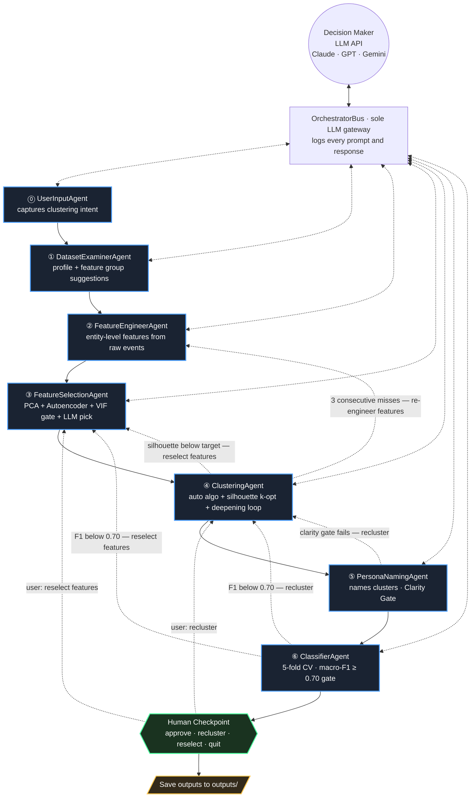
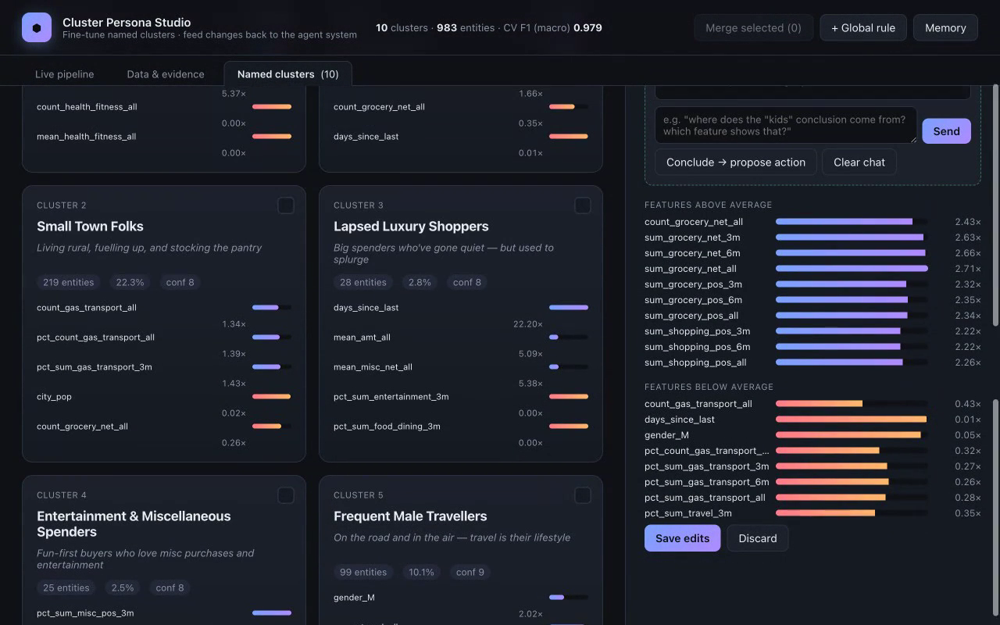
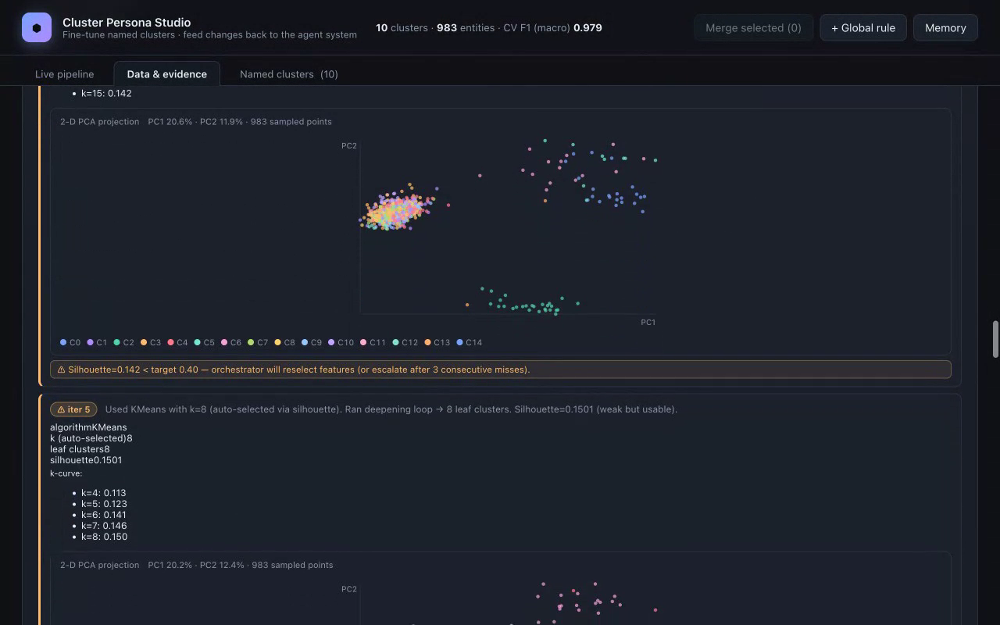
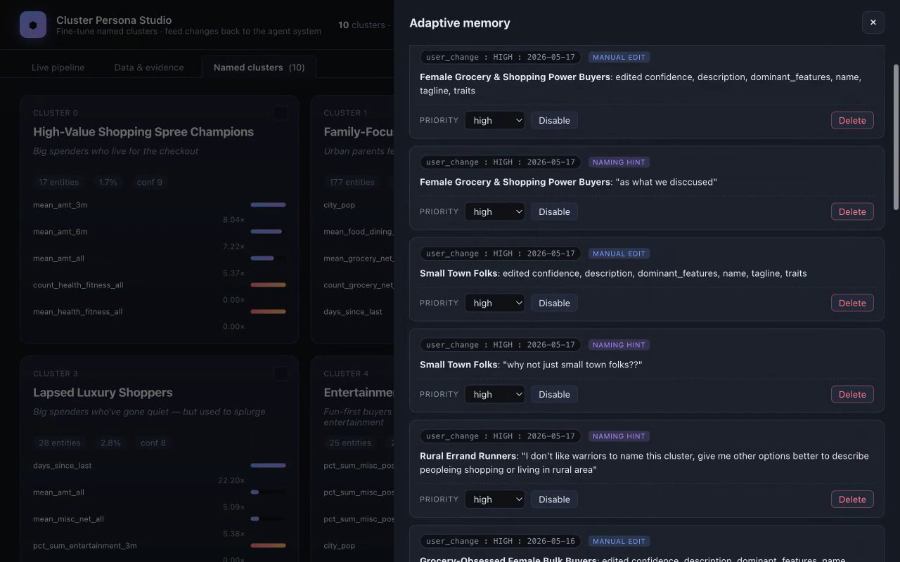

# Automated Cluster Interpretation with a Multi-Agent Pipeline

> **The hard part of clustering is not the math — it's the meaning.**

---

## The Problem

Clustering appears in almost every domain of applied data science: segmenting customers by behaviour, grouping patients by symptom profile, categorising documents by topic, organising images by visual similarity, partitioning sensor readings by operational mode. The algorithms are well established — k-means, hierarchical, GMM, DBSCAN, etc. — and any of them can produce as many clusters as you ask for in seconds.

The unsolved part is what comes after. What do those clusters *mean*? What should each one be called? What makes one group different from its neighbours — not in terms of centroid coordinates, but in terms a business or scientific audience can act on? Clustering is an unsupervised task: there are no ground-truth labels, so you cannot measure accuracy. The challenge is not prediction. It is **interpretability**.

Without automation, this loop typically runs multiple times, each iteration requiring the labelling step to be redone in full. The result is a process that is slow (days per project), undocumented (diagnostic reasoning is rarely recorded), and non-reproducible (the same data produces different segments depending on who runs the analysis).

The system described here automates the entire loop — feature engineering, selection, clustering, constraint checking, contrastive labelling, and iterative diagnosis — using a **multi-agent architecture** in which a Decision Maker (any LLM API) handles the steps that require judgment. The result: a complete, named, validated cluster solution in under one hour, at under one dollar of API cost, with a full reasoning trace for every decision.

---

## The Agent Approach

The pipeline is driven by **`run_pipeline.py`**. Seven specialised agents plus a Decision Maker form a feedback loop. Every quality gate can push the pipeline backward; it only moves forward when all gates pass (or the user approves):



Solid arrows = the forward path; dotted arrows = the feedback loops that push the pipeline backward. Every backward arrow is gated by a measurable threshold (Clarity Gate confidence, F1 macro, silhouette target) — the Decision Maker proposes new parameters for the next attempt and the loop closes around the OrchestratorBus.

### What each agent does

| # | Agent | Role |
|---|-------|------|
| ⓪ | **UserInputAgent** | Prompts for clustering intent (target entity, business purpose, dataset path). |
| ① | **DatasetExaminerAgent** | Profiles the raw data — schema, missingness, distribution shape, cardinality — and asks the Decision Maker to suggest feature engineering groups aligned with the business purpose. Also emits an algorithm hint based on skewness. |
| ② | **FeatureEngineerAgent** | Builds an entity-level feature matrix from raw event-level data. The Decision Maker reads the actual column names from the dataset schema and plans which of 8 generic statistical operations to apply (group aggregation, trends, streaks, diversity, temporal patterns, etc.). No domain vocabulary is hard-coded — the LLM reasons from the data. Saves to `data/processed/`. Skipped when a pre-built parquet is provided. |
| ③ | **FeatureSelectionAgent** | Scores all features with PCA importance and autoencoder reconstruction error, runs a VIF collinearity gate, then asks the Decision Maker to pick the best subset (typically 25–55 features). The VIF threshold and a feature-focus hint are set dynamically by the Decision Maker each iteration. |
| ④ | **ClusteringAgent** | Auto-selects the best algorithm from five options (`kmeans`, `hierarchical`, `dbscan`, `gmm`, `fuzzy_cmeans`) via `algo_recommender`. Auto-selects k via silhouette score optimisation. Runs a deepening loop to split any oversized cluster (>40%). All numeric columns are log-transformed automatically if skewed (|skewness| > 2.0). The k range, algorithm, and minimum acceptable silhouette are tuned dynamically each iteration. |
| ⑤ | **PersonaNamingAgent** | Sends cluster profiles to the Decision Maker as tables of feature deviations from the global mean. The Decision Maker writes name, tagline, description, and five traits per cluster. A **Clarity Gate** (avg confidence ≥ 6.0, all names unique) must pass or the pipeline re-clusters. |
| ⑥ | **ClassifierAgent** | Asks the Decision Maker to select the best classifier (`random_forest`, `xgboost`, `gradient_boosting`, `logistic_regression`) for the data. Trains with stratified 5-fold CV. If macro-F1 < 0.70, the Decision Maker diagnoses the root cause and routes back to ③ or ④. |

### How each agent calls the Decision Maker

Every agent follows the same four-step pattern:

1. **Compute** — run sklearn / numpy / pandas to produce statistics (PCA scores, cluster profiles, silhouette scores, etc.).
2. **Format** — assemble those statistics into a structured text prompt in Python using actual column names discovered from the data.
3. **Call** — send the prompt through `OrchestratorBus` to the LLM API (any chat-completion endpoint — Claude, GPT, Gemini, etc.).
4. **Parse** — read the Decision Maker's JSON response and act on it.

The agents are Python scripts that construct precise, data-rich prompts and parse structured responses. All LLM access of agents is mediated by the Orchestrator through `OrchestratorBus`. The cluster statistics are computed at runtime from the actual feature matrix and injected into the prompt. The Decision Maker reads those numbers and returns structured JSON with `name`, `tagline`, `description`, `dominant_features`, `traits`, `confidence`.

**Concrete example — `PersonaNamingAgent`**

The function `build_all_clusters_prompt()` dynamically assembles a prompt using features discovered from the actual data:

```
You are a behavioral analyst interpreting entity clusters.
Each cluster is described by its most distinguishing features:
  vs_avg: ratio of cluster mean to overall mean (◀ = 40%+ above; ◀◀ = 100%+ above; ▼ = 50%+ below)
  mean: the cluster's average value for that feature

CLUSTER 0  (1 234 entities, 12.3% of all entities)
Algorithm: kmeans

  ABOVE AVERAGE (strongest signals):
    count_category_food_12m                   mean=      87.4  vs_avg=2.41x ◀◀
    sum_category_travel_12m                   mean=   8200.1  vs_avg=3.18x ◀◀
    streak_category_grocery_pos               mean=       9.1  vs_avg=1.72x ◀
    …

  BELOW AVERAGE:
    event_count_all_6m                        mean=      12.3  vs_avg=0.38x ▼
    …

CRITICAL NAMING RULES — read carefully before writing any name:
1. SPECIFICITY — names must describe what the entity ACTUALLY DOES …
…

Return ONLY a valid JSON object …
```
---

## Best-Effort Fallback

If 10 iterations complete without any result passing all gates, the pipeline does **not** just exit empty-handed. Instead it:

1. Identifies the iteration with the highest silhouette score across all attempts.
2. Runs **PersonaNamer** on that clustering with `force_proceed=True` (Clarity Gate bypassed).
3. Runs **Classifier** on the result.
4. Saves all outputs and returns `status='best_effort'`.

The console prints a `⚠ BEST-EFFORT RESULT` banner so the output is clearly flagged. This guarantees a full analysis is always delivered regardless of data difficulty.

---

## Data

The pipeline is dataset-agnostic. Point it at any tabular CSV where rows are events and columns include an entity identifier, a timestamp, and descriptive attributes. The `UserInputAgent` will ask what is being clustered and what the clustering goal is. The Decision Maker reasons from the actual schema to plan feature engineering — no domain vocabulary needs to be pre-configured.

### Demo dataset

The included demo uses the [**Fraud Detection**](https://www.kaggle.com/datasets/kartik2112/fraud-detection) dataset by Kartik Shenoy on Kaggle (`kartik2112/fraud-detection`). It contains ~1.3 million simulated credit-card transactions for ~983 cardholders, with columns for merchant, category, amount, timestamp, and demographics.

**Download** (requires a [Kaggle API token](https://www.kaggle.com/docs/api)):

```bash
pip install kaggle
kaggle datasets download -d kartik2112/fraud-detection -p data/raw --unzip
```

The pipeline uses `data/raw/fraudTrain.csv` (~335 MB) for feature engineering and clustering.

---

## How to Run

**Prerequisites**

```bash
pip install -r requirements.txt
export LLM_API_KEY="sk-ant-..."   # or add to .env
```

**Run from a raw event-level CSV**

```bash
python run_pipeline.py
# UserInputAgent will prompt for: entity being clustered, business purpose, dataset path
# FeatureEngineerAgent builds the feature matrix automatically
```

**Run from a pre-built feature parquet**

```bash
# If a feature parquet already exists, the pipeline skips FeatureEngineerAgent
# and reads it directly. No extra steps needed.
python run_pipeline.py
```

The script:

- Loads `.env` and `config.yaml`
- Auto-detects whether to run FeatureEngineerAgent (raw CSV) or skip it (parquet)
- **Boots the interactive UI** in a background thread and opens your browser (use `--no-ui` to disable, `--ui-port 5090` to change port) — see [Interactive UI + Adaptive Learning](#interactive-ui--adaptive-learning) below for what you can do in it
- Runs the Decision Maker loop with `max_total_iterations=10`
- After each failure, the Decision Maker proposes new VIF/k/algorithm/silhouette parameters
- At max iterations, delivers a best-effort result if no iteration fully passed
- Writes all outputs under `outputs/` and prints a full console report

---

## Configuration (`config.yaml`)

```yaml
# ── Clustering ──────────────────────────────────────────────────────
n_clusters: ~               # null = auto-select k via silhouette optimizer (recommended)
                            # Set an integer (e.g. 6) only to force a specific k

clustering_algorithm: auto  # auto | kmeans | hierarchical | dbscan | gmm | fuzzy_cmeans
                            # auto = AlgoRecommender scores all five and picks the best
                            # The Decision Maker may override this per-iteration

# ── Classifier ──────────────────────────────────────────────────────
classifier_model: auto      # auto | random_forest | xgboost | gradient_boosting | logistic_regression
                            # auto = Decision Maker selects based on data characteristics

# ── Deepening loop ──────────────────────────────────────────────────
max_cluster_size_pct: 0.40  # split any cluster larger than this share of total entities
sub_n_clusters: 3           # how many sub-clusters to create when splitting
max_depth: 2                # max splitting rounds (0 = disabled)

# ── Persona tone ────────────────────────────────────────────────────
persona_tone: easy          # easy | professional | data-driven | creative
```

**`n_clusters: ~` (null) is the default and recommended setting.** It lets the silhouette optimizer scan `[3, 4, 5, 6, 7, 8, 10, 12, 15]` and pick the best k automatically. Set an integer only when you have a specific business requirement.

**`clustering_algorithm: auto` is recommended.** The `AlgoRecommender` skill scores all five algorithms against data shape metrics (n_entities, n_features, skewness, outlier spread) and business purpose keywords, then picks the best fit. The Decision Maker can override after each iteration.

---

## Outputs

After a successful (or best-effort) run:

| File | Description |
|------|-------------|
| `outputs/personas.json` | Machine-readable personas: name, tagline, traits, cluster stats, lineage. |
| `outputs/persona_summary.txt` | Human-readable persona cards with top distinguishing features. |
| `outputs/persona_metrics.csv` | One row per cluster × distinguishing feature: `mean_value`, `relative_to_avg`, signal strength. |
| `outputs/classifier_metrics.json` | CV accuracy/F1, per-class F1, top feature importances, reasoning. |
| `outputs/cluster_profiles.json` | Raw per-cluster statistics: `n_entities`, `pct_total`, `top_above_average`, `top_below_average`, `feature_means`. |
| `outputs/cluster_lineage.json` | Cluster tree: parent/child relationships from the deepening loop. |
| `outputs/silhouette_curve.json` | k vs silhouette score curve from the optimizer, best k, algorithm reasoning. |
| `outputs/pipeline_log.json` | Full structured log of every agent's status report across all iterations. |
| `outputs/agents_conversation.txt` | Full text log of every LLM prompt and response. |
| `data/processed/engineered_features.parquet` | Entity-level feature matrix built by FeatureEngineerAgent (when starting from CSV). |

---

## Interactive UI + Adaptive Learning

`run_pipeline.py` boots a live web UI in a background thread and auto-opens it in your browser (use `--no-ui` for headless, `--ui-port 5090` to change port). The UI is fused with the pipeline through an event bus: every agent step, LLM call, gate decision, and escalation streams over Server-Sent Events to the browser in real time.

**Named Clusters tab** — every cluster becomes an editable card. Open one and start a multi-turn conversation with the agent about why it picked those features, then **Conclude → propose action** to rename, merge, or save guidance for the next pipeline run.



**Data & Evidence tab** — per-iteration 2-D PCA projection of the clustered data, with the orchestrator's adaptive-escalation warning surfaced in line: *"Silhouette=0.142 < target 0.40 — orchestrator will reselect features (or escalate after 3 consecutive misses)"*.



**Adaptive Memory drawer** — every rename, merge, hint, and chat conclusion lands here as a prioritised rule. The next pipeline run reads this file and the Decision Maker prompts adapt accordingly — that is the "adaptive learning" loop, made literal.



### What you can see in real time

- **Architecture graph** — the seven agents light up as each one runs; the Orchestrator pulses while it's waiting for the Decision Maker.
- **Agent ↔ Decision Maker chat bubbles** — each LLM round-trip is rendered as a typing bubble so you can read the prompts and answers as they happen.
- **Per-agent outputs panel** — every agent's computed result (silhouette curve, VIF table, classifier metrics, etc.) appears in its own card and updates per iteration.
- **3 cost ledgers** — pipeline, evidence (auto-explanations), and naming (cluster chat) are billed separately so you can see exactly where the API spend goes.
- **Data & Evidence tab** — dataset profile, per-column skewness, per-iteration PCA scatter, cluster size distribution, classifier per-class F1, lineage tree, and a final per-iteration summary table with the winning iteration highlighted.
- **Named Clusters tab** — each cluster as an editable card with its name, tagline, description, traits, dominant features, and confidence; **only the best iteration's personas are shown here** (best = highest composite of F1 ↑ + Silhouette ↑ − VIF penalty).

### Feedback system — fine-tune cluster names

Each cluster card in the Named Clusters tab supports four interactions:

1. **Direct edit** — rename, retag, edit description/traits/confidence inline, then **Save edits**. The diff is persisted to `outputs/user_feedback_log.jsonl` as a `manual_override` entry.
2. **Regenerate with hint** — type a hint ("focus on dining behaviour, don't mention groceries"), pick a priority (low / medium / high), and the Decision Maker re-names the cluster taking the hint into account. Logged as `naming_hint`.
3. **Merge clusters** — pick two or more cards, hit **Merge**. The agent rebuilds the combined profile, names the merged cluster, and the original cluster IDs disappear. Logged as `merge`.
4. **Per-cluster chat (multi-turn)** — ask the agent why a trait was chosen, challenge a feature interpretation, or explore alternatives. Conclude the discussion with a proposed action — **rename** / **merge** / **keep as-is** / **save guidance for the next run**. The key learnings from each chat are pushed into the feedback log as a high-priority `global_rule` so the next pipeline run sees *why* the rename happened, not just the before/after diff.

### Adaptive learning — feedback flows back to the agents

Every entry in `outputs/user_feedback_log.jsonl` is fed into the **next pipeline run's** Decision Maker prompts, with three downstream effects:

- **PersonaNamer** reads `manual_override` + `naming_hint` entries as authoritative preferences ("the user previously renamed this style of cluster from X to Y — apply the same intuition").
- **FeatureSelector + Clusterer** receive `global_rule` entries that affect feature focus and clustering decisions ("the user said groceries shouldn't dominate this segment — down-weight grocery-related features").
- **Orchestrator's parameter-tuning prompt** reads merge/global-rule entries when deciding whether to relax silhouette targets or switch algorithms.

Combined with the **adaptive escalation rules** (silhouette miss → tune params; 3 consecutive misses → re-engineer features + fresh algorithm pick; 3 more misses → relax silhouette target), the pipeline self-corrects across iterations *and* across runs.

### Bypass vs Interactive mode

A topbar toggle switches between two modes:

- **Bypass** — when a warning fires, the pipeline auto-decides and asks an `EvidenceExplainer` LLM (separate "evidence" cost ledger) to narrate the decision in active voice on the relevant agent card. No human intervention required.
- **Interactive** — the pipeline pauses on warnings and opens a decision modal. Your guidance is saved as a high-priority memory rule that the very next iteration's prompts read.

### Memory drawer

A drawer (right side of the topbar) lists every feedback entry with filters (All / Global rules / Naming hints / Manual edits / Merges), inline add/delete, and a per-entry priority + date stamp. Inactive rules can be toggled off without deletion.

---

## Skills

The agents do not have hard-coded logic for every decision. They call shared **skills** — focused Python modules — for statistical tasks, and route Decision Maker queries through `OrchestratorBus`:

| Skill | File | Used by |
|-------|------|---------|
| **OrchestratorBus** | `skills/orchestrator_bus.py` | All agents — the sole LLM gateway; logs every prompt and response |
| **VIF checker** | `skills/vif_checker.py` | FeatureSelector — multicollinearity gate |
| **Silhouette optimizer** | `skills/silhouette_optimizer.py` | Clusterer — auto k-selection |
| **Algorithm recommender** | `skills/algo_recommender.py` | Clusterer — scores 5 algorithms and recommends the best fit |

---

## Setup (Quick)

```bash
pip install -r requirements.txt
export LLM_API_KEY="..."   # or add to .env
python run_pipeline.py
```

Open **`outputs/persona_summary.txt`** for full persona cards and **`outputs/persona_metrics.csv`** for structured metrics after the run.
